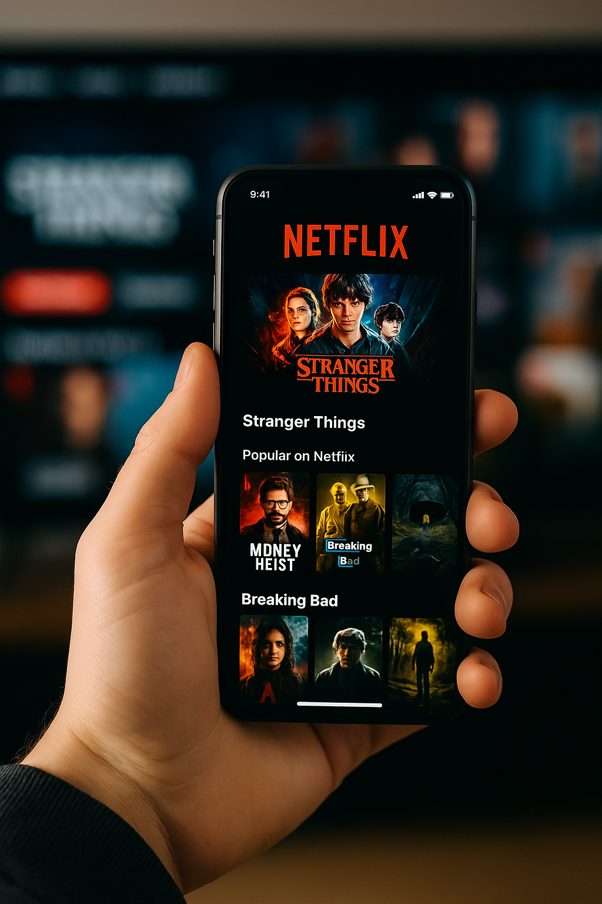

# 🌐 Abishek Puri – Portfolio  

A personal portfolio website showcasing my **projects, skills, and resume**. Built with **HTML, CSS, and JavaScript**, featuring animations, dark mode, and responsive design.  

---

## 🚀 Live Demo  
🔗 [Visit Portfolio](https://ivakehs77.github.io/Abishek-Puri--Portfolio/)  

---

## 📖 About  
This is my personal portfolio site where I:  
- Introduce myself and my background  
- Showcase my projects with descriptions and images  
- Highlight my technical skills with progress bars  
- Provide links to my **resume, GitHub, LinkedIn, and Instagram**  

The site is hosted with **GitHub Pages** and kept simple with just HTML, CSS, and vanilla JS (plus Particles.js for visuals).  

---

## 🛠️ Tech Stack  
- **Frontend:** HTML5, CSS3, JavaScript  
- **Libraries:** [Particles.js](https://vincentgarreau.com/particles.js/)  
- **Tools:** Git, GitHub, VS Code  

---

## 📷 Screenshots  

### Hero Section  
  

### Projects  
  

---

## 📦 Installation / Usage  
```bash
# Clone the repository
git clone https://github.com/ivakehs77/Abishek-Puri--Portfolio.git

# Open the project
cd Abishek-Puri--Portfolio

# Run locally
open index.html   # (or just double click it)
